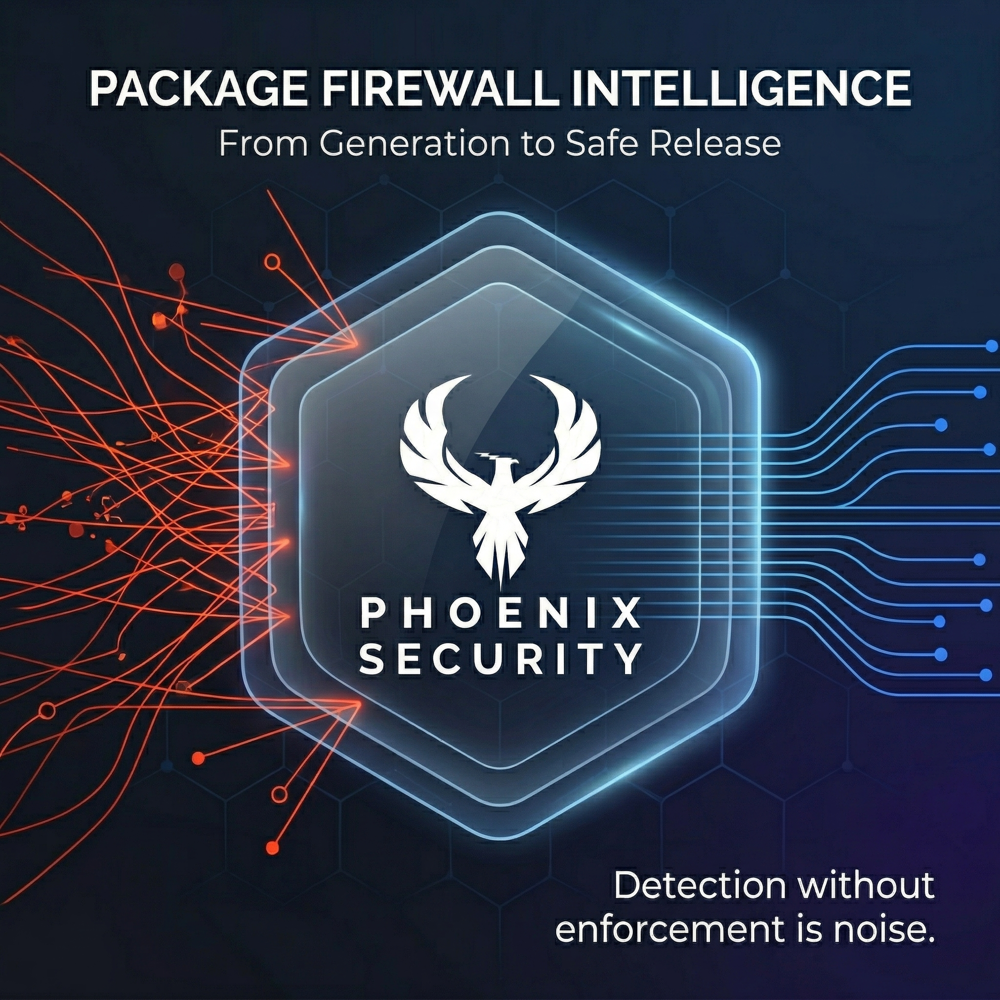

# Phoenix Supply Chain Firewall — Agent Hub

> Protect AI coding agents from malicious and vulnerable packages. One command secures Claude Code, Cursor, Codex, Windsurf, Cline, and Aider.
<p align="center">
  
</p>

<h1 align="center">Phoenix Supply Chain Agent Firewall</h1>

<p align="center">
  <strong>Detection without enforcement is noise.</strong><br>
  Intelligence-driven package firewall for agents.
</p>

<p align="center">
  <a href="https://github.com/Security-Phoenix-demo/phoenix-firewall/actions"></a>
  <a href="https://github.com/Security-Phoenix-demo/phoenix-firewall/releases"></a>
  <a href="LICENSE"></a>
  <a href="https://phxintel.security.io"></a>
</p>

## Quick Start

```bash
# Initialize in your project (detects agents, scaffolds config)
npx @phoenix-security/cli init

# Install PreToolUse hook for Claude Code
npx @phoenix-security/cli install-hooks claude-code

# Scan a lockfile
npx @phoenix-security/cli scan package-lock.json

# Run the MCP server directly
npx -y @phoenix-security/mcp-firewall
```

Set `PHOENIX_API_KEY` in your environment. Get your key at [phxintel.security](https://phxintel.security).

## What This Does

When an AI coding agent tries to install a package, the Phoenix Firewall checks it against:
- **Malware intelligence** — 77 signals, dual-LLM adversarial verification (MPI v3.1)
- **Vulnerability data** — CVSS, EPSS, CISA KEV, ransomware associations
- **PS-OSS risk scores** — 0-100 open source risk assessment
- **License compliance** — SPDX categories, copyleft detection
- **Supply chain hygiene** — package age, maintainer reputation, typosquatting

If blocked, agents receive a structured `for_llm_reasoning` narrative explaining *why* and suggesting safe alternatives — enabling autonomous remediation without human intervention.

## Packages

| Package | Description | Install |
|---------|-------------|---------|
| [@phoenix-security/mcp-firewall](packages/mcp-firewall/) | MCP server with 7 `phoenix_*` tools | `npx -y @phoenix-security/mcp-firewall` |
| [@phoenix-security/cli](packages/cli/) | CLI: init, install-hooks, scan, doctor | `npx @phoenix-security/cli <cmd>` |
| [@phoenix-security/schema](packages/schema/) | Shared TypeScript types + JSON schemas | `npm i @phoenix-security/schema` |

## Agent Configuration

### Claude Code
Add to `.mcp.json` in your project root:
```json
{
  "mcpServers": {
    "phoenix-firewall": {
      "command": "npx",
      "args": ["-y", "@phoenix-security/mcp-firewall"],
      "env": { "PHOENIX_API_KEY": "${PHOENIX_API_KEY}" }
    }
  }
}
```

### Cursor
Add to `.cursor/mcp.json` (same format as above).

### Codex CLI
Configure in `~/.codex/hooks.json` — see [hooks/codex/](hooks/codex/).

### Windsurf / Cline / Aider
See [hooks/](hooks/) for agent-specific configuration.

## MCP Tools

| Tool | Description |
|------|-------------|
| `phoenix_check_package` | Pre-install check — block/warn/allow verdict with remediation |
| `phoenix_check_lockfile` | Batch scan all dependencies |
| `phoenix_check_diff` | Evaluate only changed deps from git diff |
| `phoenix_get_package_intel` | Full intelligence: PS-OSS, vulns, malware, license |
| `phoenix_get_alternatives` | Safe alternatives for blocked packages |
| `phoenix_get_vulnerability` | CVE details with EPSS, KEV, remediation |
| `phoenix_firewall_rules` | Your active firewall rules summary |

## Claude Skills

Copy to `~/.claude/skills/` for opinionated workflows:
- `phoenix-security:vet-dependency` — check before installing
- `phoenix-security:audit-lockfile` — scan before committing
- `phoenix-security:remediate-vuln` — find safe alternatives

## CI Templates

Primary CI templates (GitHub Actions, GitLab, Jenkins, Azure DevOps, Bitbucket) live in [phoenix-firewall/integrations/](https://github.com/Security-Phoenix-demo/phoenix-firewall/tree/main/integrations).

## Domains

| Domain | Purpose |
|--------|---------|
| `api.phxintel.security` | REST API (primary) |
| `mcp.phxintel.security` | Hosted MCP server (Streamable HTTP) |
| `dev.phxintel.security` | Dev/staging |

## Security

See [SECURITY.md](SECURITY.md) for vulnerability reporting and supply chain verification.

## License

Apache-2.0 — see [LICENSE](LICENSE).
